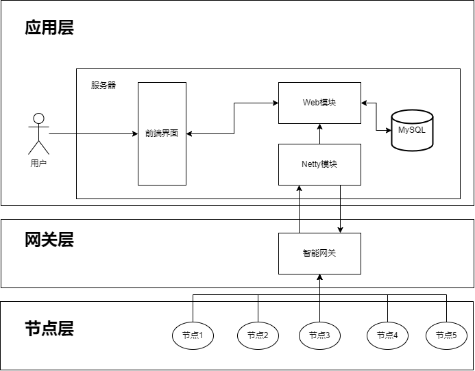

# 空间智能联合实验室平台

> 一个展示实验室的环境信息平台！
>
> SpringBoot + Netty + MyBatis-Plus的项目，仅含网站后台的代码。

## 项目背景

和睿住科技有限公司合作的项目，项目主要是为了监测实验室的环境信息，并且针对这些采集的环境信息进行人的热舒适分析，根据分析的结果来控制室内的照明，风扇，空调等设备来降低能耗，实现超低能耗的建筑。

## 功能

- 使用Netty架构实现与实验室的智能网关的通信
  - 采用实验室的自定义协议进行通信。
  - 继承Netty架构中的LengthFieldBasedFrameDecoder解码器，实现对实验室的协议帧的长度数据的提取，解决通信过程中出现的粘包半包的问题。
  - 定义多种自定义的帧编解码器实现自定义的帧构成，比如MessageCodecSharable，ContentCodec等。
  - 定义具体的处理类对不同的帧进行处理，比如登录，心跳，环境表数据，电表数据等。
  - 使用RPC + Dubbo实现对Web模块的方法进行调用。
  - 对智能网关下发控制帧，实现对照明，风扇，空调等设备的控制(todo)。
- 使用SpringBoot + MyBatis-Plus架构实现web模块，对前端的请求进行响应
  - 实现对环境数据信息的查询及插入
  - 基于 MyBatis-Plus 框架的 QueryWrapper 实现对 MySQL 数据库的灵活查询，并配合 MyBatis X 插件自动生成后端 CRUD 基础代码，减少重复工作
- 定义公共的前端响应类BaseResponse进行响应体的封装，并且定义全局的异常处理类对抛出的异常进行处理，同时针对一些重复使用的方法提取出来作为工作类

## 技术栈

### 后端

- 主语言：Java
- 开发框架：SpringBoot + Netty + MyBatis-Plus + Dubbo
- 数据库：MySQL

## 整体架构

> 仅供参考

## 通信协议

本次与智能网关的通信协议采用的改进的376.1协议，具体可查看[376.1协议百度文库](https://wenku.baidu.com/view/deadb498b24e852458fb770bf78a6529647d359a.html?_wkts_=1677941703945&bdQuery=376.1%E5%8D%8F%E8%AE%AE)。